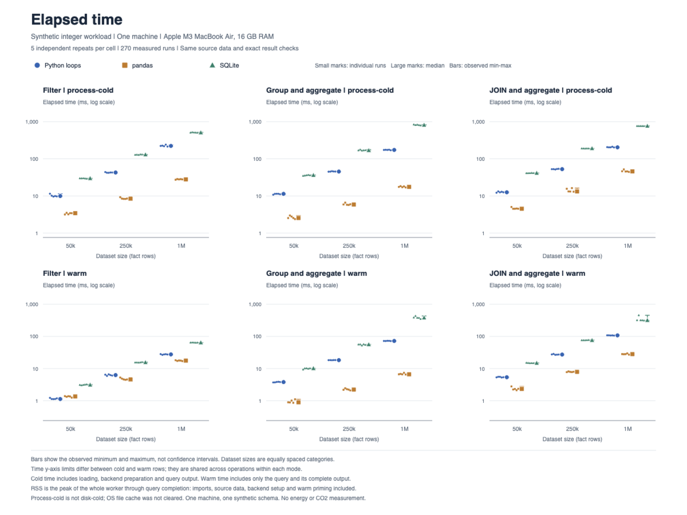
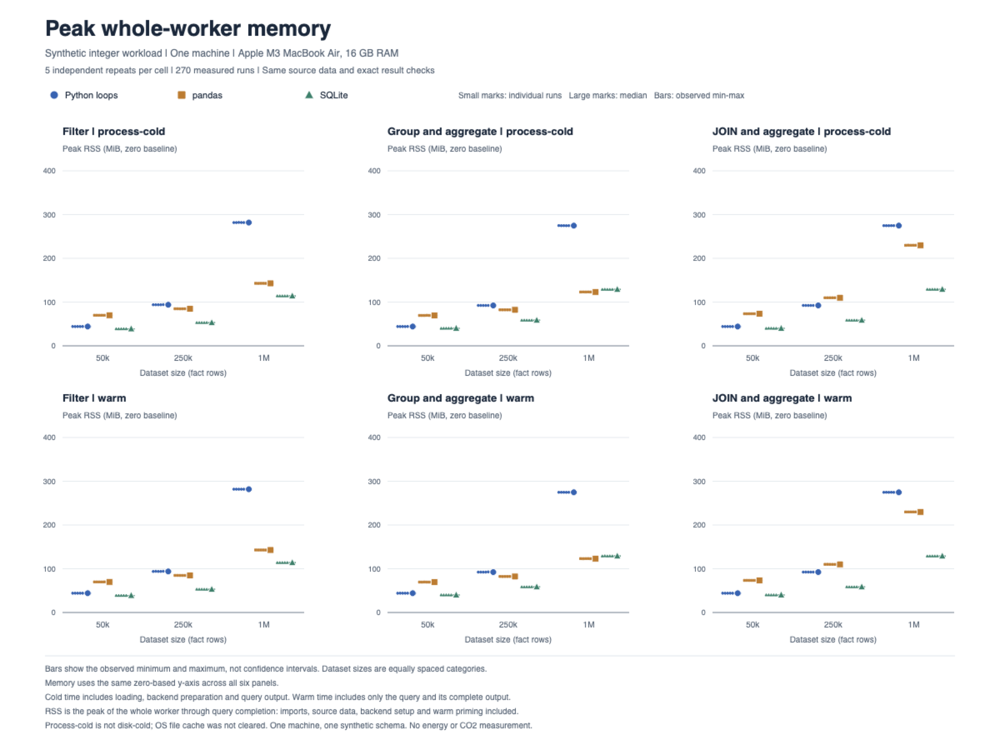

# Processing efficiency study

**English** | [Italiano](README.it.md)

A reproducible comparison of Python loops, pandas and SQLite on identical synthetic data. It answers a practical question: how do processing time and memory change when the same filter, grouping or JOIN is implemented in different ways?

For junior data analysts and developers, this is a worked example of designing a fair comparison, checking equivalent outputs and explaining time/memory tradeoffs. The repository contains the program, generated inputs, real measurements and analysis. The experiment ran on one Apple M3 MacBook Air with 16 GB RAM on 1 October 2026. These are synthetic integer records, not customer data.

## What the measurements show

At one million rows, pandas had the lowest median time for all three operations, both with preparation included and in warm execution. Its warm execution was **1.56 times as fast as Python for filtering, 10.89 times for grouping and 3.84 times for JOIN and aggregation**.

The smaller dataset changes the picture. At 50,000 rows, the warm filter took **1.13 ms in Python and 1.35 ms in pandas**. Including loading and preparation reversed their order: **9.94 ms and 3.42 ms**, respectively. The useful comparison depends on where the timer starts.



For the million-row warm JOIN, SQLite had a lower median peak worker RSS than pandas: **128.91 MiB versus 229.83 MiB**. It also took longer: **317.70 ms versus 28.05 ms**. Choosing by time alone would hide this difference.



Each point is a real observation. Bars show the observed minimum and maximum of five repeats, not confidence intervals. Ratios compare matching medians and do not establish universal speedups.

Median elapsed time at 1,000,000 fact rows, in milliseconds:

| Operation | Mode | Python | pandas | SQLite |
|---|---|---:|---:|---:|
| Filter | Process-cold | 223.09 | 27.94 | 509.94 |
| Group and aggregate | Process-cold | 173.93 | 17.51 | 815.28 |
| JOIN and aggregate | Process-cold | 204.47 | 45.89 | 767.63 |
| Filter | Warm | 27.55 | 17.68 | 64.07 |
| Group and aggregate | Warm | 72.13 | 6.62 | 380.16 |
| JOIN and aggregate | Warm | 107.68 | 28.05 | 317.70 |

Explore the [raw measurements](results/main/raw.csv), [complete summary](results/analysis/summary.csv) or Russian report in [PDF](reports/synthetic-processing-study-ru.pdf) and [editable DOCX](reports/synthetic-processing-study-ru.docx).

## Quick start: analyze the collected data

Run from the repository root with Python 3.12. This rebuilds summaries and figures without running the benchmark:

```sh
git clone https://github.com/Gr1gorii/processing-efficiency-study.git
cd processing-efficiency-study
python3.12 -m venv .venv
source .venv/bin/activate
python -m pip install -r requirements.txt
python src/analyze.py --machine-label "Apple M3 MacBook Air, 16 GB RAM"
python -m unittest discover -s tests -v
python src/audit_results.py
```

The machine label describes the bundled measurements, not the computer running the analysis. Charts are saved as vector PDF and PNG. PNG rendering requires Poppler's `pdftoppm` or macOS `sips`; PDFs are preserved if neither is available. The collector targets macOS and Unix-like systems; Native Windows collection is unsupported because the worker uses POSIX facilities.

## What was compared

The main matrix contains 50,000, 250,000 and 1,000,000 fact rows, three implementations, three operations, two timing modes and five repeats: **270 main measurements**. A separate **36-trial pilot** checked feasibility and correctness first. The customer dimension has 5,000 unique keys. Inputs use int64, contain no nulls or strings, and have no unmatched foreign keys.

- **Filter:** select records by status and amount, return ordered ID/amount pairs.
- **Group:** count records and sum amounts by category.
- **JOIN:** inner join customers, then count records and sum amounts by customer segment.

Python uses row lists and a dictionary, pandas uses integer DataFrames, and SQLite uses an in-memory database with a customer primary key and no fact-table indexes. This compares these concrete implementations, including their different representations.

**Process-cold** times loading the shared NPZ, backend preparation, execution, ordering and complete output materialization. Imports and process launch are excluded. OS caches were not cleared, so this is not disk-cold performance.

**Warm** times execution and complete output after one untimed prime. Each repeat still uses a fresh worker, and loading and preparation are excluded from its timer.

**Peak RSS** is the whole worker's memory high-water mark through query completion, before validation. It includes imports, input arrays, backend structures and warm priming. It is not incremental query memory or exclusively owned physical memory.

Data seed: `20261001`. Main schedule seed: `73129`. Blocks and execution order were randomized, with workers running sequentially. Recorded versions: Python 3.12.14, NumPy 2.3.5, pandas 2.2.3, SQLite 3.53.1 and macOS 26.7.1. Numerical-library thread limits were set to 1; SQLite `PRAGMA threads=1` limits auxiliary query threads, not the process's total threads.

## Correctness and limits

All **306 measured outputs matched exact reference digests**. Six tests cover hand-calculated cases, threshold boundaries, negative values, empty input, unmatched JOIN keys, deterministic generation and schedule coverage. The audit checks saved measurements, summaries and provenance without collecting new timings.

Pilot and main workers used 90.20 seconds of parent-observed wall time against a 900-second cumulative limit. The largest observed RSS was 282.08 MiB. No safeguard stop or increase in the recorded swapout counter occurred.

There are only five repeats per main condition and one machine. Background applications, CPU affinity and thermal state were not controlled; the recorded one-minute system load ranged from 4.17 to 5.24. Small timing differences deserve particular care. Strings, nulls, skewed keys, disk databases and different indexes may change the results. Energy was not measured, and no energy or CO2 conclusion follows from these timings.

The [methodology](docs/METHODOLOGY.md), [pre-pilot clarifications](docs/IMPLEMENTATION_ADDENDUM.md) and [pilot decision](docs/PILOT_DECISION.md) record the design and stopping rules.

## Reproduce or adapt the experiment

Follow [Run your own experiment](docs/RUN_YOUR_OWN.md) to collect a pilot and main run in a separate directory, preserving the published evidence. It explains how to change sizes, keep generation and configuration consistent, check your pilot and analyze the new results. The collector has a 15-minute cumulative worker budget and a 20-minute campaign deadline; it refuses to overwrite an existing collection.

To adapt an operation, change its three implementations in `src/backends.py`, the independent reference in `src/dataset.py` and the hand-calculated tests in `tests/test_correctness.py`. Regenerate inputs and manifests, then validate before measuring. The supplied narrative audit targets the original matrix and tables; adapt it when changing the study.

## Repository map

- `src/`: data generation, backends, per-trial worker, collector, analyzer and audit.
- `tests/`: correctness and schedule tests.
- `data/`: canonical NPZ inputs and reference manifests.
- `results/`: raw CSV/JSON/JSONL, schedules, recorded environment and analysis tables. [Public data notes](docs/PUBLIC_DATA.md) document removal of local paths and transient process IDs; measured values are retained.
- `charts/`: time and memory figures in PNG and PDF.
- `docs/`: methodology, decisions and narrative material.
- `reports/`: Russian reports, including the expanded PDF and DOCX.

## License

A license has not yet been selected. Licensing is pending the repository owner's decision.
